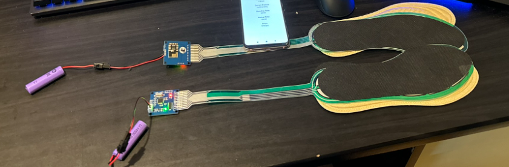
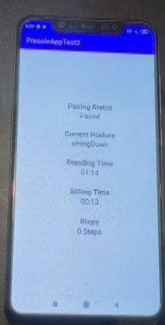

# Presole – A smart pressure sensing shoe insole package

A pressure sensor embedded into a shoe insole… and much more!

This project is an on-going project that my former team members are contiuning.

The design details, intellectual property and software code are owned by my team and it is not allowed to share specific details nor source code in this repo. 

Demonstration only - no source code

## Overview

Presole is a project composed of a team of three nursing students, one electronic engineering student and and a computer science student (me). My role in this project is to develop the A.I Activity Classification Model and the prototype app fundementals for my team.

The vision of the project is to provide a cost effective solution for general customers to track their day to day walking and standing habits and their **raise awareness to fix their posture**. 

The goal of the prototype is to demonstrate that the app can detect whether a user is standing/walking in a bad or good posture **solely from data analysis from the pressure distribution data** from the two shoe insole. 

## Deliverables
The project consists of 3 parts:

- **An smart insole hardware sensor** - The hardware consists of an Arduinio MPU6050 board with Bluetooth sender/receiver module. A velostat sensor sheet is welded to the board to get analog voltage readings which represents the pressure distribution of the user's foot. The hardware is crammed in between an foam insole material.

- **A.I Activity Classification Model** - The project uses **Turi Create’s Activity Classifier** model framework to generate predictions of the user’s posture based on the input data set. This is a prototype only, hence only 700 rows of data are used for training data and 300 rows of data are used for testing data.

- **Android Prototype App** - The app prototype is developed using Android Studio. The goal of the app is to demonstrate the connectivity capability of the insole to the smart phone, and the ability of the app to tell users their current posture, based on the activity classification result from the model and the data feeded from the two insole devices. The app also tracks the standing, sitting time and steps of the user. 

As my former team continues on with the project, the app will eventually be re-designed in a more user friendly way with more features based on the core fundementals built on this prototype. The activity classification model will also be trained with way more training data and more testing users to improve accuracy.

## Usage Demo

## Awards

- **Health Future Challenge 2022 Challenge Co-innovation award**
- **Cyberport Creative Micro Fund HKD $100,000 Grant**